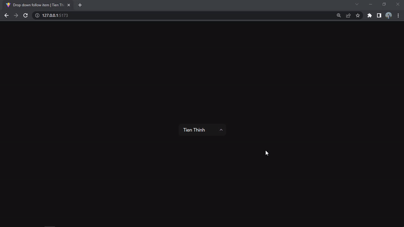

# drop-down-follow-item

Inspiration from dropdown panel of spline.design

## Result

## Created with

- React v18
- styled-components
- Custom hook

## To improve:
- Make a Menu like a Popover

## To test in your local

- Clone to your machine:
  `git clone https://github.com/TienThinh-fe/drop-down-follow-item.git`
  
- Access to project folder: `cd drop-down-follow-item`

- Install packages: `npm i`

- Run Vite server: `npm run dev`
